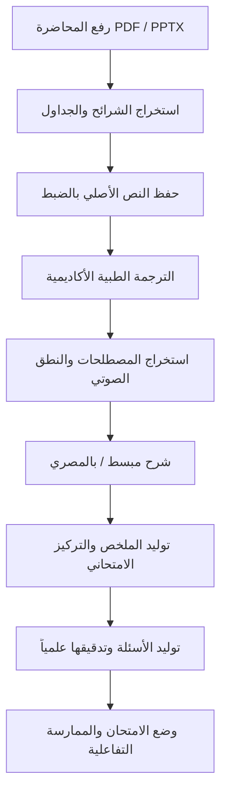

# Nursing Study AI — منصة دراسة التمريض الذكية

> **منصة تعليمية إكلينيكية متقدمة ومصممة خصيصاً لطلاب كليات ومعاهد التمريض في مصر** لتحويل المحاضرات الإنجليزية إلى مذكرات طبية تفاعلية مدققة علمياً، تجمع بين الحفظ الصوتي، والترجمة الأكاديمية المعتمدة، وشرح المفاهيم باللهجة المصرية، والتدريب على الامتحانات.

---

## 🌟 نظرة عامة ورسالة المنصة (Core Mission)

يدرس طلاب التمريض في الجامعات المصرية مناهجهم الطبية باللغة الإنجليزية، وغالباً ما يواجهون تحديات في:
1. استيعاب المصطلحات التمريضية والدوائية الدقيقة دون تشويه لمعناها العلمي.
2. النطق الصحيح للمصطلحات اللاتينية والإنجليزية مع الرموز الصوتية (IPA).
3. ربط النظريات الأكاديمية بالواقع السريري وأسئلة الامتحانات الجامعية.

**مبدأ الأمانة العلمية والدقة الطبية (Medical Integrity):**
- المنصة **تحفظ النص الإنجليزي الأصلي حرفياً** ولا تستبدله مطلقاً.
- تُفصل الترجمة الأكاديمية، والشرح التوضيحي ("شرح بالمصري")، والأسئلة المولدة بصرياً وبشكل لا يقبل اللبس.
- كل سؤال تم توليده يتم تدقيقه وربطه مباشرة بـ **رقم الشريحة المصدرية (Source Slide)**.

---

## 🚀 مسار المذاكرة والتعلم (Study Workflow)



---

## 💻 التقنيات المستخدمة (Tech Stack)

- **Framework**: [Next.js 14](https://nextjs.org/) (App Router, Server-side API routes, React 18, TypeScript).
- **Styling & Design System**: Tailwind CSS مع نظام ألوان طبي هادئ (`#F8FAFC`, `#0F4C81`, `#2563EB`, `#7C3AED`, `#15803D`, `#B45309`, `#B91C1C`).
- **Typography**: خط Cairo / Tajawal للواجهة العربية الفصيحة، وخط Inter للمصطلحات والنصوص الطبية الإنجليزية.
- **Audio Pronunciation**: محرك Web Speech API بالسرعات الثلاث (`0.75x`, `1.0x`, `1.25x`) ونطق إنجليزي بشري دقيق.
- **Document Extractors**: مستخرج XML مباشر لشرائح الباوربوينت `PPTX` باستخدام `JSZip` بدون أي تبعيات خارجية ثقيلة.
- **AI Engine**: Google Gemini API عبر مسارات خادم مشفرة ومحمية مع حماية الكوتا والـ Caching.
- **PWA**: دعم كامل لتثبيت التطبيق كـ Progressive Web App على هواتف Android و iPhone وأجهزة الحاسوب.

---

## 📁 هيكل المشروع (Folder Structure)

```
nursing-study-ai/
├── public/
│   ├── manifest.json              # إعدادات الـ PWA
│   ├── sw.js                      # Service Worker للتصفح بلا إنترنت
│   └── icons/                     # أيقونات التطبيق للشاشات المختلفة
├── src/
│   ├── app/
│   │   ├── layout.tsx             # الإطار العام، الخطوط، والـ Viewport
│   │   ├── page.tsx               # الصفحة الرئيسية ولوحة تحكم الطالب
│   │   ├── lectures/
│   │   │   ├── page.tsx           # مكتبة المحاضرات ورفع الملفات (PDF / PPTX)
│   │   │   ├── [id]/page.tsx      # قارئ المحاضرة ثنائي اللغة والمصطلحات والملخصات
│   │   │   └── [id]/exam/page.tsx # وضع الامتحان التفاعلي المؤقت مع تحليل الأخطاء
│   │   ├── dictionary/page.tsx    # قاموس المصطلحات الطبية والنطق الصوتي
│   │   ├── profile/page.tsx       # ملف الطالب، الفرقة الدراسية، والوضع الليلي
│   │   └── api/
│   │       ├── ai/translate/      # مسار الترجمة الطبية
│   │       ├── ai/explain/        # مسار الشرح بالمصري والأكاديمي
│   │       ├── ai/summary/        # مسار الملخصات (سريع، قياسي، تفصيلي)
│   │       ├── ai/questions/      # مسار توليد أسئلة MCQ وصواب/خطأ ومقالي
│   │       ├── ai/validate/       # مسار تدقيق وفحص الأسئلة
│   │       └── youtube/           # مسار مصادر الشرح المرئي الرسمية
│   ├── components/
│   │   ├── layout/                # MobileBottomNav, DesktopSidebar, TopHeader
│   │   ├── lecture/               # SlideViewer, AudioPronounce, ExplainModal, LectureSearch
│   │   └── theme/                 # ThemeProvider للوضع الليلي والنهاري
│   ├── lib/
│   │   ├── ai/geminiClient.ts     # استدعاء آمن لـ Gemini من الخادم وحماية الكوتا
│   │   ├── audio/speech.ts        # محرك النطق الصوتي بالسرعات
│   │   ├── parsers/               # مستخرج الباوربوينت والمحاضرات النموذجية
│   │   └── storage/repository.ts  # مستودع البيانات المحلي والـ Firestore
│   ├── prompts/                   # وحدات برومبتات الذكاء الاصطناعي المستقلة
│   └── types/index.ts             # نماذج TypeScript الكاملة
├── .env.example
├── .env.local
├── tailwind.config.ts
├── tsconfig.json
└── package.json
```

---

## ⚙️ التثبيت والتشغيل المحلي (Quickstart)

```bash
# 1. التوجه لمجلد المشروع
cd nursing-study-ai

# 2. تثبيت الحزم والاعتماديات
npm install

# 3. نسخ ملف متغيرات البيئة
cp .env.example .env.local

# 4. تشغيل خادم التطوير المحلي
npm run dev

# افتح المتصفح على الرابط:
# http://localhost:3005
```

---

## 🔑 إعداد متغيرات البيئة (Environment Variables)

في ملف `.env.local`:

```env
# 1. مفتاح Google Gemini المجاني من https://aistudio.google.com/
GEMINI_API_KEY=AIzaSy...

# 2. مفتاح YouTube Data API v3 (اختياري)
YOUTUBE_API_KEY=AIzaSy...

# 3. إعدادات Firebase (اختياري - المنصة تعمل محلياً وفورياً بدونها)
NEXT_PUBLIC_FIREBASE_API_KEY=
NEXT_PUBLIC_FIREBASE_PROJECT_ID=
```

---

## 🔒 أمان البيانات وسرية المفاتيح (Security Rules)

1. **حظر المفاتيح في الواجهة الأمامية**: لا يتم تمرير أي مفتاح خاص للمتصفح مطلقاً. كافة استدعاءات الذكاء الاصطناعي تتم عبر Server-Side API Routes.
2. **حماية الكوتا المجانية (Free-Tier Safeguards)**:
   - نظام Caching ذكي يمنع تكرار نفس الطلبات لنفس الشريحة.
   - قيود على عدد المحاولات (Retry backoff).
   - محتوى تمريضي نموذجي مُسبق الإعداد (محاضرة أنواع الصدمات الحادة) للاستخدام المباشر دون استهلاك أي كوتا.

---

## 🧪 سيناريوهات الفحص والتحقق (Test Cases)

| الاختبار | النتيجة المتوقعة |
| :--- | :--- |
| **محاضرة نموذجية (Shock)** | 6 شرائح كاملة، ترجمة طبية، 12 مصطلح، أسئلة MCQ وصواب وخطأ، مصادر يوتيوب. |
| **النطق الصوتي** | يعمل بسرعات 0.75x و 1.0x و 1.25x مع إمكانية الإيقاف المؤقت والإعادة. |
| **شرح الشريحة (بالمصري)** | يفتح نافذة منفصلة تعرض الشرح باللهجة المصرية والعربي الفصيح والإنجليزي المبسط. |
| **وضع الامتحان** | يتيح اختيار 10، 20، 30، 50 سؤال، يخفي الإجابات أثناء الاختبار، ويظهر تشخيص الأخطاء فور التسليم. |
| **البحث داخل المحاضرة** | يبحث فورياً في النصوص والمصطلحات والأسئلة مع الانتقال المباشر للشريحة. |
| **الوضع الليلي (Dark Mode)** | يتوافق مع ألوان مريحة للعين ويحفظ تفضيل المستخدم في `localStorage`. |
| **الهواتف الذكية (Mobile First)** | شريط ملاحة سفلي يحتوي على (الرئيسية، محاضراتي، القاموس، الاختبارات، ملفي). |

---

## 👨‍⚕️ إخلاء مسؤولية طبي (Medical Disclaimer)

هذه المنصة أداة مساعدة تعليمية مخصصة لطلاب التمريض للدراسة والمراجعة الذاتية، وليست بديلاً عن التوجيه الأكاديمي للجامعات، أو إشراف أساتذة الكلية، أو القرارات الإكلينيكية والسريرية داخل المستشفيات وأقسام الرعاية الحرجة.

---

صُنع بكل فخر لدعم طلاب التمريض في مصر ❤️🇪🇬
